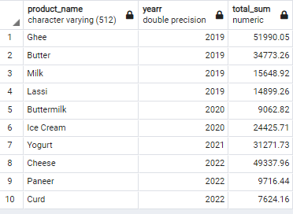

# Analysis of Dairy Products using SQL


I assumed the role of a data analyst for a dairy association in India that looks out for the welfare, expansion, and advancement of the dairy industry in the study region.

## The Cycle

Dairy cooperatives (brands) buy cow milk from dairy farmers and then process it in their dairy facilities. Pasteurization, homogenization, and standardization are all done during processing to guarantee milk quality and safety. The milk is further processed depending on the type of dairy product being manufactured. Other dairy products include butter, buttermilk, cheese, yoghurt, ice cream, ghee, lassi, curd, and paneer. Wholesale, retail, and online channels are used to market processed dairy products.

##  Problem Statement

The dairy association is keen on knowing how its member dairy processors(brands) perform on the market and what kinds of dairy products consumers like. To get insights into product demand, market dynamics, and possible areas for product diversification, a thorough data analysis of dairy product sales and trends is required.

The dairy association also aims to curb financial losses among its member processors(brands) due to wastage by optimizing inventory management for dairy products. Analysis of inventory levels, production cycles, and demand trends for dairy products is essential to identify gaps.

The specific objectives are to determine;
1) most popular dairy product
2) consumers' preferred dairy products across different locations
3) consumers' most preferred brand for each dairy product
4) product that generates the highest revenue for each brand
5) highest sales year of each dairy product
6) quarterly evaluation of each dairy product
7) inventory turnover ratio of dairy products, and
8) dairy products' average shelf life


This analysis seeks to provide the dairy association with useful data so that its member processors may make informed choices, maintain their competitiveness in the dairy market, and receive useful recommendations for streamlining procurement.

## Skill/concepts demonstrated
- Database: PostgreSQL was used throughout the analysis. 

## Data Source
The dataset used for this project was obtained from Kaggle, It focuses on specific dairy brands which operate in selected Indian states and union territories between 2019 and 2022. To access the data, click [here](https://www.kaggle.com/datasets/suraj520/dairy-goods-sales-dataset?select=dairy_dataset.csv).

This is what the dataset looks like ⬇️


## Data Preprocessing
- I used an online converter, [tableconvert](https://tableconvert.com/csv-to-sql) to convert my data from an Excel CSV format to a Postgres form of creating a table. Click on “load file” to upload the file.
  


- Changed the table name from “tableName” to “DairyFarm”, ticked the ‘generate a create table’ icon, and changed the quotes from “No quotes” to “PostgreSQL”, after which I clicked “Copy to Clipboard” to copy the generated codes.
  


- Create a database on your PostgreSQL, open a query tool, and paste the already copied codes. Run your query, Hola! You already have a table.

## Data Cleaning
- Rename the table
- Rename the columns
- Convert the date columns from varchar datatype to date datatype
- No duplicate or missing values in the dataset
  
The full data cleaning procedure can be found in the file named "dairy_product_data_preprocessing.sql" in this repository.

_N.B: The table and columns were renamed because the generator added quotation marks to all variables, hence the need to rename them for better accessibility._

## Data Analysis

It is crucial to determine if all brands produce the 10 dairy items to improve understanding of the data and the rationale for using specific metrics for analysis.

- Number of products each dairy processor(brand) manufactures
  ```
  SELECT brand, COUNT(product_name) product_count
  FROM (SELECT brand, product_name, product_id
        FROM dairy_farm
        GROUP BY brand, product_name, product_id) AS inner1
  GROUP BY 1
  ORDER BY 2 DESC;
  ```
Output: 


This demonstrates that not all brands produce the 10 dairy products under consideration. I’ll primarily utilize the mean to measure to prevent bias in the analysis.
One must note the data of dairy products that were captured/recorded before expiration and after expiration should NOT be analyzed together or viewed as a single dataset, this is because they reflect various periods and conditions.

- I created two temporary tables; when the products were within their shelf life and after the expiration of the dairy products
```
CREATE TEMPORARY TABLE within_shelf_life AS
SELECT *
FROM dairy_farm
WHERE recording_date < expiration_date;

CREATE TEMPORARY TABLE after_expiration AS
SELECT *
FROM dairy_farm
WHERE recording_date >= expiration_date;
```

**1. Most popular dairy product**
```
SELECT product_name, ROUND(AVG(quantity_sold)::numeric, 2) avg_quantity_sold
FROM within_shelf_life
GROUP BY product_name
ORDER BY 2 DESC
LIMIT 1;
```
Output:


Since it may identify untapped market potential and facilitate product alignment, this information aids brands in positioning themselves effectively in the market.

**2. Consumers preferred dairy products across different locations.**
```
SELECT sub3.product_name, sub3.customer_location, sub2.max_avg_quantity_sold
FROM (SELECT customer_location, max(avg_quantity_sold) max_avg_quantity_sold
      FROM (SELECT product_name, customer_location, ROUND(AVG(quantity_sold)::numeric, 2) avg_quantity_sold
            FROM within_shelf_life
            GROUP BY 1,2) AS sub1
      GROUP BY 1) AS sub2 
JOIN (SELECT product_name, customer_location, ROUND(AVG(quantity_sold)::numeric, 2) avg_quantity_sold
      FROM within_shelf_life
      GROUP BY 1,2) sub3
ON sub2.customer_location = sub3.customer_location AND sub2.max_avg_quantity_sold = sub3.avg_quantity_sold
ORDER BY 1;
```
Output:


The dairy association can pinpoint regions with different product preferences by analyzing customer preferences across locations. To cater to consumer preferences and needs, brands may tailor their products and create location-specific marketing plans.

Additionally, brands can also give priority to areas where their products are most likely to thrive.

**3. Consumers' most preferred brand for each dairy product.**
```
SELECT sub3.product_id, sub3.product_name, sub3.brand
FROM (SELECT product_name, MAX(total_quantity) max_total_quantity
      FROM (SELECT brand, product_name, ROUND(SUM(quantity_sold)::numeric,2) total_quantity
            FROM within_shelf_life
            GROUP BY 1,2) AS sub1
      GROUP BY 1) AS sub2
JOIN (SELECT product_id, brand, product_name, ROUND(SUM(quantity_sold)::numeric,2) total_quantity
      FROM within_shelf_life
      GROUP BY 1,2,3) AS sub3
ON sub3.product_name=sub2.product_name AND sub2.max_total_quantity = sub3.total_quantity
ORDER BY 1;
```
Output:


This analysis could assist the dairy association in educating brands about consumer perception and market performance, which may enable brands to create marketing plans that cater to consumer preferences and enhance brand reputation and loyalty.

**4. Product that generates the highest revenue for each brand**
```
SELECT inner3.brand, inner3.product_name, inner3.tot_rev
FROM (SELECT brand, MAX(tot_rev) max_rev
      FROM (SELECT brand, product_name, ROUND(SUM(total_revenue)::numeric,2) tot_rev
            FROM within_shelf_life
            GROUP BY 1,2) AS inner1
      GROUP BY 1) AS inner2
JOIN (SELECT brand, product_name, ROUND(SUM(total_revenue)::numeric,2) tot_rev
      FROM within_shelf_life
      GROUP BY 1,2) AS inner3
ON inner2.brand = inner3.brand AND inner2.max_rev=inner3.tot_rev;
```
Output:


The dairy association may determine which goods are the most profitable for its members by determining the product that contributes the most to each brand’s revenue. This information enables the dairy association to help its members make wise decisions about the investment of capital in equipment and marketing.

**5. Highest sales year of each dairy product.**
```
SELECT sub3.product_name, sub3.yearr, sub3.total_sum
FROM (SELECT product_name, MAX(total_sum) max_total
      FROM (SELECT product_name, DATE_PART('year', recording_date) yearr, ROUND(SUM(quantity)::numeric, 2) total_sum
            FROM within_shelf_life
            GROUP BY 1,2) sub1
      GROUP BY 1)sub2
JOIN (SELECT product_name, DATE_PART('year', recording_date) yearr, ROUND(SUM(quantity)::numeric, 2) total_sum
      FROM within_shelf_life
      GROUP BY 1,2) sub3
ON sub2.product_name=sub3.product_name AND sub2.max_total = sub3.total_sum
ORDER BY 2;
```
Output:



Dairy associations can retrieve past results of certain products by knowing the maximum sales year for each dairy product. It can be used to recognize market trends and competition. They can respond to shifting market conditions and assess the elements that contributed to successful years.

**6. Quarterly evaluation of each dairy product**
```
SELECT product_id, product_name, DATE_PART('quarter', recording_date) quarter,
       ROUND(AVG(quantity)::numeric, 2) total_quantity
FROM (SELECT *
      FROM within_shelf_life) inner1
GROUP BY 1,2,3
ORDER BY 1,3;
```
Output:


This allows the dairy association to identify seasonal demand patterns quarterly. During times of significant consumer interest, brands can plan targeted marketing campaigns.

**7. Inventory turnover ratio of dairy products**
```
SELECT product_id, SUM(quantity_sold) AS total_quantity_sold, 
       ROUND(AVG(quantity_in_stock)::numeric,2) AS avg_inventory_level,
       ROUND(CAST (SUM(total_revenue)/AVG(quantity_in_stock) AS numeric), 2) AS inventory_turnover_ratio
FROM after_expiration
GROUP BY product_id
ORDER BY 1;
```
Output:


Having a significantly higher quantity than the average sales rate signifies an inventory management issue. This assists the association in detecting the problem of excess inventory or overstocking, both of which cause financial loss to brands.

_N.B: The data used for analysis is the data after product expiration._

**8. Dairy products' average shelf life**
```
SELECT product_name, ROUND(AVG(shelf_life)::numeric) AS avg_shelf_life
FROM dairy_farm
GROUP BY 1
ORDER BY 2;
```
Output:


Shelf life information allows the dairy association to align inventory levels with seasonal demand variations.

## Summary

The COVID-19 pandemic’s economic effects have negatively impacted the dairy sector, resulting in a drop in demand for dairy goods and interruptions to supply networks.

The growing demand for dairy substitutes made from plants is one of the most noteworthy developments in the dairy business.

Animal welfare concerns, environmental sustainability issues, and human health issues have all fueled this trend. The market for plant-based dairy products is expanding mostly due to the popularity of veganism and vegetarianism.

## Recommendations

* Brands should focus their promotional efforts to capitalize on peak sales periods.
* Dairy farmers should diversify their operations to include plant-based dairy alternatives.
* The dairy association should implement a first-in-first-out(FIFO) system to ensure older stock is sold before newer stock to minimize the expiration of products.
* The dairy association should implement regular demand forecasting and monitoring of stock levels.
* Inventory levels should be adjusted to seasonal demand variations.
* Brands should align procurement with actual demand to prevent overstocking
